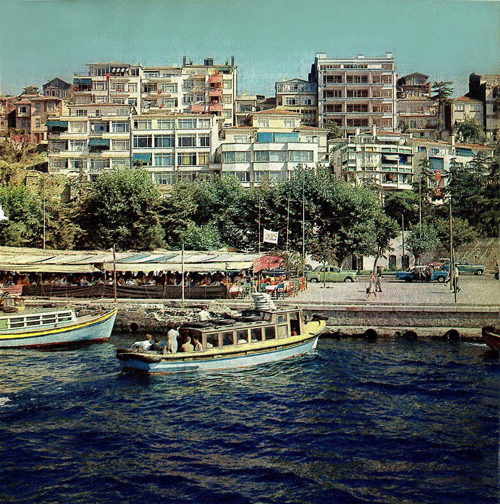

# OpenCV

I am sharing this repository for free with the codes. I have written for OpenCV. I will update it regularly!

The main picture we used:

### Basic Operations
[load_image](./load_image.py)

[gray_image](./gray_image.py)

[create_image](./create_image.py)

[pixel_read_write](./pixel_read_write.py)

[merging_two_images](./merging_two_images.py)

### Performance Criteria
[image_pixel_value_statistics](./image_pixel_value_statistics.py)

[image_pixel_normalization](./image_pixel_normalization.py)

### Video Reading and Writing
[video_read_and_write](./video_read_and_write.py)

### Image Flip
[image_flip](./image_flip.py)

### Drawing Geometric Shapes on Images
[draw_geometry](./draw_geometry.py)

### Thresholding
[basic_thresholding](./basic_thresholding.py)

### Video Reading, Writing and Processing
[video_read_write_and_process](./video_read_write_and_process.py)

### Changing the Color Space
[changing_colorspace](./changing_colorspace.py)

### Geometric Transformations
[geometric](./geometric.py)

### Region of Interest
[roi](./roi.py)

### Creating a Histogram
[histogram](./histogram.py)

### Histogram equalization
[histogram_equal](./histogram_equal.py)

### Histogram Comparison
[hist_comp](./hist_comp.py)

### Gauss Blur
[bileteral_blur](./bileteral_blur.py)

### Edge-Preserving Filtering Algorithm
[edge_filtering](./edge_filtering.py)

### Sobel Filter
[sobel](./sobel.py)

### Canny Edge Detection
[canny](./canny.py)

### Otsu Thresholding
[otsu_thresholding](./otsu_thresholding.py)

### Image Contours
[image_contours](./image_contours.py)

### Hoffman Line Detection
[hoffman_line_detection](./hoffman_line_detection.py)

### Hoffman Probabilistic Line Detection
[prob_hoffman](./prob_hoffman.py)

### Hoffman Circle Detection
[hoffman_circle_detection](./hoffman_circle_detection.py)

### Background Extraction
[video_background](./video_background.py)

### Removing Background from Moving Objects
[roi_extraction](./roi_extraction.py)

### KLT-Based Optical Flow
[dense_optical_flow](./dense_optical_flow.py)

### Grabcut: Image Segmentation
[grabcut_image_segmentation](./grabcut_image_segmentation.py)

### Grabcut: Changing the Background
[grabcut_background_change](./grabcut_background_change.py)

